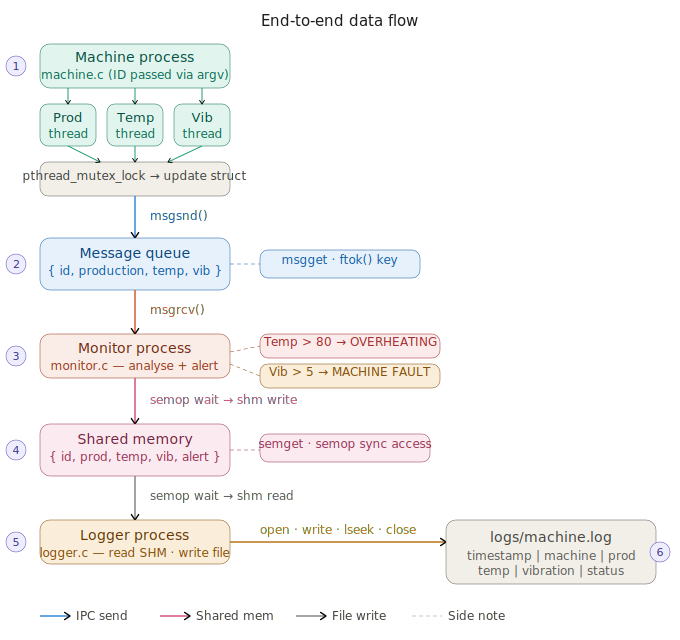

<div align="center">

<!-- HEADER BANNER -->


<br/>

[](https://en.wikipedia.org/wiki/C_(programming_language))
[](https://www.linux.org/)
[](https://man7.org/linux/man-pages/man7/svipc.7.html)
[](https://man7.org/linux/man-pages/man7/pthreads.7.html)
[](LICENSE)

<br/>

> **A real-time multi-process industrial monitoring system built entirely in C on Linux, demonstrating mastery of process management, IPC, threads, signals, semaphores, and file I/O.**

<br/>

</div>

---

## 📋 Table of Contents

| # | Section |
|---|---------|
| 1 | [🏭 Project Overview](#-project-overview) |
| 2 | [🏗️ System Architecture](#️-system-architecture) |
| 3 | [🔄 Data Flow Diagram](#-data-flow-diagram) |
| 4 | [⚙️ Process Architecture](#️-process-architecture) |
| 5 | [🧵 Thread Model](#-thread-model) |
| 6 | [📡 IPC Communication Map](#-ipc-communication-map) |
| 7 | [📁 Project Structure](#-project-structure) |
| 8 | [🛠️ Build & Run](#️-build--run) |
| 9 | [📊 Feature Table](#-feature-table) |
| 10 | [🧪 Test Scenarios](#-test-scenarios) |
| 11 | [📜 System Calls Reference](#-system-calls-reference) |
| 12 | [📈 Sample Output](#-sample-output) |
| 13 | [⚠️ Signal Handling](#️-signal-handling) |

---

## 🏭 Project Overview

The **Industrial Machine Monitoring System** is a full-stack **Linux systems programming project** written in **C**. It simulates a real-world factory environment where multiple industrial machines run simultaneously, a central monitor analyzes the data, and a logger persists everything to disk.

### 🎯 Core Objectives

```
┌─────────────────────────────────────────────────────────────────────────┐
│                         SYSTEM GOALS                                    │
├───────────────────────────┬─────────────────────────────────────────────┤
│  Multi-Process Simulation │  4 child processes for machines/monitor/log │
│  Inter-Process Comm (IPC) │  Message Queue + Shared Memory              │
│  Thread-based Sensors     │  3 POSIX threads per machine                │
│  Real-time Monitoring     │  Anomaly detection and alerting             │
│  Persistent Logging       │  File I/O with system calls (open/write)    │
│  Signal Handling          │  Graceful shutdown + status broadcast       │
└───────────────────────────┴─────────────────────────────────────────────┘
```

---

## 🏗️ System Architecture

## 🏗️ System Architecture


## 🔄 Data Flow

╔══════════════════════════════════════════════════════════════════════════════╗
║                    INDUSTRIAL MACHINE MONITORING SYSTEM                      ║
║                         High-Level Architecture                              ║
╠══════════════════════════════════════════════════════════════════════════════╣
║                                                                              ║
║   ┌──────────────────────────────────────────────────────────────────────┐  ║
║   │                   PARENT: Factory Controller                         │  ║
║   │                        main.c  (PID: root)                           │  ║
║   │          fork() × 4  |  exec()  |  waitpid()  |  SIGINT handler      │  ║
║   └──────────┬───────────┬──────────────┬─────────────────┬──────────────┘  ║
║              │           │              │                 │                  ║
║              ▼           ▼              ▼                 ▼                  ║
║   ┌──────────────┐ ┌──────────────┐ ┌──────────────┐ ┌──────────────────┐  ║
║   │  MACHINE 1   │ │  MACHINE 2   │ │   MONITOR    │ │     LOGGER       │  ║
║   │  machine.c   │ │  machine.c   │ │  monitor.c   │ │    logger.c      │  ║
║   │              │ │              │ │              │ │                  │  ║
║   │ 3 Threads:   │ │ 3 Threads:   │ │  Recv MQ     │ │  Read SHM        │  ║
║   │ • Production │ │ • Production │ │  Analyze     │ │  Write Log File  │  ║
║   │ • Temp       │ │ • Temp       │ │  Alert       │ │  open/write/     │  ║
║   │ • Vibration  │ │ • Vibration  │ │  Write SHM   │ │  lseek/close     │  ║
║   │              │ │              │ │              │ │                  │  ║
║   │  mutex lock  │ │  mutex lock  │ │  semaphore   │ │  semaphore       │  ║
║   └──────┬───────┘ └──────┬───────┘ └──────┬───────┘ └────────┬─────────┘  ║
║          │                │                │                  │             ║
║          └────────────────┘                │                  │             ║
║                   │                        │                  │             ║
║          ┌────────▼────────┐      ┌────────▼──────────────────▼──────────┐  ║
║          │  MESSAGE QUEUE  │─────▶│           SHARED MEMORY              │  ║
║          │  (System V IPC) │      │       + SEMAPHORE (sync)             │  ║
║          │  msgget/msgsnd  │      │   shmget/shmat/shmdt/semget/semop    │  ║
║          │  /msgrcv        │      │                                      │  ║
║          └─────────────────┘      └──────────────────────────────────────┘  ║
║                                                                              ║
║          ┌─────────────────────────────────────────────────────────────┐    ║
║          │                   logs/machine.log                          │    ║
║          │  timestamp | machine | production | temp | vibration | status│   ║
║          └─────────────────────────────────────────────────────────────┘    ║
╚══════════════════════════════════════════════════════════════════════════════╝
```

---

## 🔄 Data Flow Diagram

```
┌─────────────────────────────────────────────────────────────────────────────┐
│                          END-TO-END DATA FLOW                               │
└─────────────────────────────────────────────────────────────────────────────┘

  MACHINE PROCESS                                                              
  ┌──────────────────────────────────┐                                        
  │  Thread: Production Generator   │──┐                                      
  │  Thread: Temperature Generator  │  │  pthread_mutex_lock()                
  │  Thread: Vibration Generator    │──┘  shared struct update                
  └──────────────┬───────────────────┘                                        
                 │  Every 1 second                                             
                 │  msgsnd() ──────────────────────────────────────────────┐  
                 ▼                                                          │  
  ┌──────────────────────────────────┐                                     │  
  │        MESSAGE QUEUE             │                                     │  
  │  { machine_id, prod, temp, vib } │ ◀─────────── msgget() key          │  
  └──────────────┬───────────────────┘                                     │  
                 │  msgrcv()                                                │  
                 ▼                                                          │  
  MONITOR PROCESS                                                           │  
  ┌──────────────────────────────────┐                                     │  
  │  Receive & Print Data            │                                     │  
  │  Check Thresholds:               │                                     │  
  │    temp > 80  → OVERHEATING      │                                     │  
  │    vib  > 5   → FAULT            │                                     │  
  │  Set alert_flag in struct        │                                     │  
  │  semaphore wait → shm write      │                                     │  
  └──────────────┬───────────────────┘                                     │  
                 │  semaphore signal                                        │  
                 ▼                                                          │  
  ┌──────────────────────────────────┐                                     │  
  │         SHARED MEMORY            │                                     │  
  │  { id, prod, temp, vib, alert }  │                                     │  
  └──────────────┬───────────────────┘                                     │  
                 │  semaphore wait → shm read                              │  
                 ▼                                                          │  
  LOGGER PROCESS                                                            │  
  ┌──────────────────────────────────┐                                     │  
  │  Read SHM → Print to Console     │                                     │  
  │  open()  → machine.log           │ ◀───────────────────────────────────┘  
  │  write() → append log entry      │                                        
  │  lseek() → reposition            │                                        
  │  close() → cleanup               │                                        
  └──────────────────────────────────┘                                        
                 │                                                             
                 ▼                                                             
  ┌──────────────────────────────────────────────────────────────────────┐    
  │  logs/machine.log                                                    │    
  │  2024-01-15 10:23:45 | Machine1 | Prod:45 | Temp:67 | Vib:3 | OK    │    
  │  2024-01-15 10:23:46 | Machine2 | Prod:38 | Temp:82 | Vib:2 | ALERT │    
  └──────────────────────────────────────────────────────────────────────┘    
```

---

## ⚙️ Process Architecture

```
┌─────────────────────────────────────────────────────────────────────────────┐
│                         PROCESS LIFECYCLE                                   │
└─────────────────────────────────────────────────────────────────────────────┘

main.c (Parent)
│
│  fork() ──────────────────────────────────────────────────────────────────┐
│                                                                            │
├─── fork() → exec("./machine", "1")     ┌─────────────────────────────┐   │
│                                        │       MACHINE 1              │   │
├─── fork() → exec("./machine", "2")     │  • Accept argv[1] = ID       │   │
│                                        │  • Create 3 threads          │   │
├─── fork() → exec("./monitor")          │  • Generate sensor data      │   │
│                                        │  • Lock mutex → update data  │   │
└─── fork() → exec("./logger")           │  • Send to Message Queue     │   │
                                         └─────────────────────────────┘   │
                                                                            │
Parent waits with waitpid()                                                 │
Detects child exit → prints "Child process terminated"                      │
                                                                            │
SIGNAL FLOW:                                                                │
  Ctrl+C → SIGINT → Parent → broadcast to all children                     │
  kill -USR1 <pid> → SIGUSR1 → Print status of all processes               │
                                                                            └┘
```

---

## 🧵 Thread Model

```
┌──────────────────────────────────────────────────────────────────────────┐
│                    MACHINE PROCESS — THREAD DESIGN                       │
├──────────────────────────────────────────────────────────────────────────┤
│                                                                          │
│   MACHINE PROCESS (main thread)                                          │
│          │                                                               │
│          ├─── pthread_create() ──▶ Thread 1: Production Generator       │
│          │                              │                               │
│          │                              │  every 1s: rand() % 100       │
│          │                              │  pthread_mutex_lock()         │
│          │                              │  machine.production = value   │
│          │                              │  pthread_mutex_unlock()       │
│          │                                                               │
│          ├─── pthread_create() ──▶ Thread 2: Temperature Generator      │
│          │                              │                               │
│          │                              │  every 1s: 50 + rand() % 50   │
│          │                              │  pthread_mutex_lock()         │
│          │                              │  machine.temperature = value  │
│          │                              │  pthread_mutex_unlock()       │
│          │                                                               │
│          └─── pthread_create() ──▶ Thread 3: Vibration Generator        │
│                                         │                               │
│                                         │  every 1s: rand() % 10        │
│                                         │  pthread_mutex_lock()         │
│                                         │  machine.vibration = value    │
│                                         │  pthread_mutex_unlock()       │
│                                                                          │
│   SHARED DATA STRUCTURE (protected by mutex):                            │
│   ┌────────────────────────────────────────┐                            │
│   │  typedef struct {                      │                            │
│   │    int machine_id;                     │                            │
│   │    int production;  ◀── Thread 1       │                            │
│   │    int temperature; ◀── Thread 2       │                            │
│   │    int vibration;   ◀── Thread 3       │                            │
│   │  } MachineData;                        │                            │
│   └────────────────────────────────────────┘                            │
│                                                                          │
│   SYNCHRONIZATION:  pthread_mutex_t machine_mutex = PTHREAD_MUTEX_INIT  │
└──────────────────────────────────────────────────────────────────────────┘
```

---

## 📡 IPC Communication Map

```
┌──────────────────────────────────────────────────────────────────────────┐
│                     IPC MECHANISMS OVERVIEW                              │
└──────────────────────────────────────────────────────────────────────────┘

  ┌──────────────────┐         MESSAGE QUEUE          ┌─────────────────┐
  │    MACHINE 1     │ ──── msgsnd(msgid, &msg, ...) ─▶│               │
  │    MACHINE 2     │ ──── msgsnd(msgid, &msg, ...) ─▶│    MONITOR    │
  └──────────────────┘          System V IPC           │               │
                               key = ftok()            └───────┬─────── ┘
                                                               │
                         ┌──────────────────────────────────── │ ──┐
                         │         SHARED MEMORY                │   │
                         │      shmget() / shmat()              │   │
                         │                                      │   │
                         │   Monitor writes ─────────────────▶  │   │
                         │                                      │   │
                         │   ┌──────────────────────────────┐  │   │
                         │   │  SharedData {                 │  │   │
                         │   │    int machine_id;            │  │   │
                         │   │    int production;            │◀─┘   │
                         │   │    int temperature;           │      │
                         │   │    int vibration;             │      │
                         │   │    int alert_flag;            │      │
                         │   │  }                            │      │
                         │   └──────────────────────────────┘      │
                         │           │                              │
                         │    SEMAPHORE (semget/semop)              │
                         │    Controls read/write access            │
                         │           │                              │
                         │           ▼                              │
                         │   Logger reads ─────────────────────────▶│
                         │                                           │
                         └───────────────────────────────────────────┘

  ┌──────────────────────────────────────────────────────────────────┐
  │   IPC COMPARISON TABLE                                           │
  ├─────────────────┬────────────────┬─────────────────┬────────────┤
  │  Mechanism      │  Direction     │  Used Between   │  Purpose   │
  ├─────────────────┼────────────────┼─────────────────┼────────────┤
  │  Message Queue  │  Many → One    │  Machine→Monitor│  Raw data  │
  │  Shared Memory  │  One → One     │  Monitor→Logger │  Processed │
  │  Semaphore      │  Sync          │  Monitor+Logger │  Mutex SHM │
  │  pthread_mutex  │  Thread-local  │  Threads within │  Thread sync│
  │                 │                │  each Machine   │            │
  └─────────────────┴────────────────┴─────────────────┴────────────┘
```

---

## 📁 Project Structure

```
industrial-monitor/
│
├── 📄 Makefile                    ← Build system (all / run / clean / test)
│
├── 📁 src/                        ← All source files
│   ├── main.c                     ← Parent controller: fork/exec/waitpid
│   ├── machine.c                  ← Machine process: threads + mutex + MQ
│   ├── monitor.c                  ← Monitor: receive MQ + analyze + SHM
│   └── logger.c                   ← Logger: read SHM + file I/O
│
├── 📁 include/                    ← Shared headers
│   └── common.h                   ← Structs, constants, shared definitions
│
└── 📁 logs/                       ← Output directory
    └── machine.log                ← Runtime log file (auto-generated)
```

### 📄 File Responsibilities

| File | Role | Key System Calls / APIs |
|------|------|------------------------|
| `main.c` | Parent controller, spawns all children | `fork()`, `exec()`, `waitpid()`, `signal()` |
| `machine.c` | Simulates sensors with threads | `pthread_create()`, `pthread_mutex_lock()`, `msgsnd()` |
| `monitor.c` | Receives data, detects anomalies | `msgrcv()`, `shmget()`, `shmat()`, `semop()` |
| `logger.c` | Reads SHM, writes log file | `semop()`, `open()`, `write()`, `lseek()`, `close()` |
| `common.h` | Shared structs and constants | — |

---

## 🛠️ Build & Run

### Prerequisites

```bash
# Make sure you have GCC and POSIX libraries
sudo apt-get install build-essential
```

### Building the Project

```bash
# Compile all binaries
make all

# Output:
# gcc -o bin/main   src/main.c   -lpthread
# gcc -o bin/machine src/machine.c -lpthread
# gcc -o bin/monitor src/monitor.c -lpthread
# gcc -o bin/logger  src/logger.c  -lpthread
```

### Running the System

```bash
# Start the full system (parent launches all children)
make run

# Or manually:
./bin/main
```

### Cleanup

```bash
# Remove all binaries and logs
make clean
```

### Makefile Targets Summary

| Target | Description |
|--------|-------------|
| `make all` | Compile all 4 programs |
| `make run` | Start the full system |
| `make clean` | Remove binaries and logs |
| `make test` | Run automated test scenarios |

---

## 📊 Feature Table

| Feature | Concept Used | Implementation |
|---------|-------------|----------------|
| 4 child processes | `fork()` + `exec()` | `main.c` spawns machine×2, monitor, logger |
| Sensor simulation | `rand()` + `sleep()` | Production, Temperature, Vibration |
| Parallel threads | `pthreads` | 3 threads per machine process |
| Thread safety | `pthread_mutex_t` | Locks on shared `MachineData` struct |
| Machine → Monitor | System V Message Queue | `msgget`, `msgsnd`, `msgrcv` |
| Monitor → Logger | Shared Memory | `shmget`, `shmat`, `shmdt` |
| Concurrent SHM access | Semaphore | `semget`, `semop` |
| Anomaly detection | Threshold checks | Temp > 80 → ALERT, Vib > 5 → FAULT |
| Log persistence | POSIX file I/O | `open`, `write`, `lseek`, `close` |
| Graceful shutdown | Signal handling | `SIGINT` → cleanup all resources |
| Status broadcast | Signal handling | `SIGUSR1` → print status of all procs |
| Zombie prevention | `waitpid()` | Parent waits for all children |
| Error handling | Return code checks | Every syscall validated |

---

## 🧪 Test Scenarios

### ✅ Test 1 — Normal Operation

```
Expected Flow:
Machine 1 started — PID: 1234
Machine 2 started — PID: 1235
Monitoring system started
Logger started

Machine 1 → Production: 45 | Temperature: 67 | Vibration: 3
Machine 2 → Production: 38 | Temperature: 72 | Vibration: 2

Monitor received data — Machine 1 | Prod:45 | Temp:67
Logger received data — Machine1 | Production 45 | Temp 66

[All normal — no alerts generated]
```

---

### 🔴 Test 2 — Anomaly / Failure Scenario

```
Simulate: Temperature artificially raised above 80°C
          Vibration raised above 5

Expected Output:
  ⚠  ALERT: Machine 2 overheating (Temp: 83)
  ⚠  ALERT: Machine 1 machine fault (Vibration: 7)

Log entry:
  2024-01-15 10:23:46 | Machine2 | Prod:38 | Temp:83 | Vib:2 | ALERT
```

---

### 🛑 Test 3 — Graceful Shutdown (Ctrl+C)

```
Press Ctrl+C

Expected:
  → SIGINT received by parent
  → Parent signals all children
  → Each process:
       - Stops its loops
       - Detaches shared memory (shmdt)
       - Closes message queue (msgctl IPC_RMID)
       - Closes open files
  → Prints: "System shutting down safely"
  → No zombie processes remain
  → Verified with: ps aux | grep machine
```

---

## 📜 System Calls Reference

```
┌─────────────────────────────────────────────────────────────────────────┐
│                     LINUX SYSTEM CALLS USED                             │
├──────────────────┬──────────────────────────────────────────────────────┤
│  CATEGORY        │  SYSTEM CALLS                                        │
├──────────────────┼──────────────────────────────────────────────────────┤
│  Process Mgmt    │  fork(), exec(), waitpid(), exit(), getpid()        │
│  Signals         │  signal(), kill(), raise(), sigaction()             │
│  Threads         │  pthread_create(), pthread_join(),                   │
│                  │  pthread_mutex_lock(), pthread_mutex_unlock()        │
│  Message Queue   │  msgget(), msgsnd(), msgrcv(), msgctl()             │
│  Shared Memory   │  shmget(), shmat(), shmdt(), shmctl()               │
│  Semaphores      │  semget(), semop(), semctl()                        │
│  File I/O        │  open(), write(), read(), lseek(), close()          │
│  Misc            │  sleep(), rand(), srand(), time(), ftok()           │
└──────────────────┴──────────────────────────────────────────────────────┘
```

---

## 📈 Sample Output

```
$ make run

======================================
  Industrial Machine Monitoring System
======================================

Factory Controller Started
Controller PID: 8821

Machine 1 started
PID: 8822

Machine 2 started
PID: 8823

Monitoring system started
Logger started

--- Cycle 1 ---
Machine 1 | Production: 45 | Temperature: 67 | Vibration: 3
Machine 2 | Production: 38 | Temperature: 72 | Vibration: 2
Machine1 sent data
Machine2 sent data

Monitor received data
  Machine 1 | Production: 45 | Temperature: 67
Monitor received data
  Machine 2 | Production: 38 | Temperature: 72

Logger received data
  Machine1 | Production 45 | Temp 67

--- Cycle 4 ---
  ⚠  ALERT: Machine 2 overheating (Temp: 83)

^C
System shutting down safely
Child process terminated
Child process terminated
Child process terminated
Child process terminated
```

---

## ⚠️ Signal Handling

```
┌─────────────────────────────────────────────────────────────────────────┐
│                        SIGNAL FLOW DIAGRAM                              │
└─────────────────────────────────────────────────────────────────────────┘

  User (Ctrl+C)
       │
       │  SIGINT
       ▼
  ┌─────────────┐    broadcast   ┌──────────┐  ┌──────────┐  ┌──────────┐
  │   PARENT    │ ─────────────▶ │ MACHINE1 │  │ MACHINE2 │  │ MONITOR  │
  │  main.c     │                │ Stop loop│  │ Stop loop│  │ Stop loop│
  └─────────────┘                │ Close MQ │  │ Close MQ │  │ Detach SHM│
                                 └──────────┘  └──────────┘  └──────────┘

  kill -USR1 <pid>
       │
       │  SIGUSR1
       ▼
  ┌─────────────┐
  │  Any Process│  Prints:
  │             │  ─────────────────────────────
  │             │  System Status
  │             │  Machine1 running
  │             │  Machine2 running
  │             │  Monitor active
  │             │  Logger active
  └─────────────┘
```

| Signal | Trigger | Action |
|--------|---------|--------|
| `SIGINT` | `Ctrl+C` | Stop all loops, release IPC, close files, print shutdown |
| `SIGUSR1` | `kill -USR1 <pid>` | Print current system status |

---

## 🔐 Synchronization Summary

| Resource | Protected By | Mechanism |
|----------|-------------|-----------|
| `MachineData` struct (per machine) | `pthread_mutex_t` | POSIX thread mutex |
| Shared Memory (Monitor writes) | Semaphore | `semop()` wait/signal |
| Shared Memory (Logger reads) | Semaphore | `semop()` wait/signal |
| Message Queue ordering | System V IPC | Kernel-managed queue |

---

